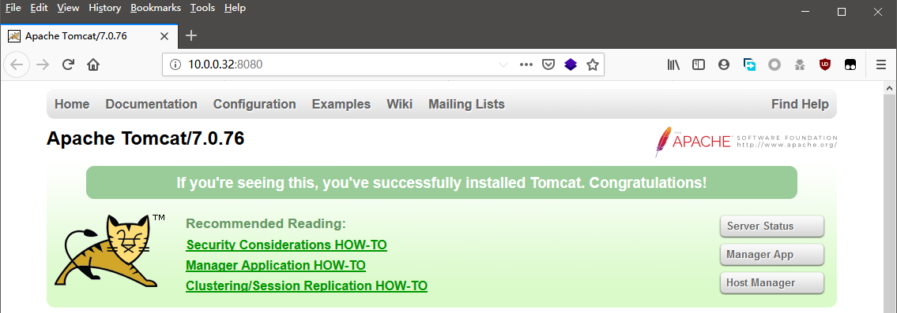
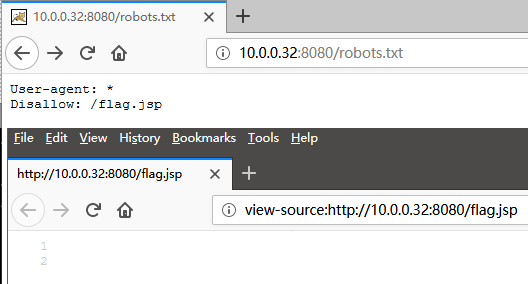
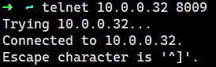
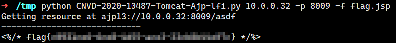

[TOC]

# 渗透题 - 出题思路（CVE-2020-1938 / CNVD-2020-10487）

## 学习要点

+ `CVE-2020-1938`文件读取

## 设计思路

Web根目录存在一个`flag.jsp`文件，其中有flag，但直接访问不会显示。需要使用某种方法读取源码。

## 操作步骤

访问站点，显示tomcat版本为`7.0.76`。



扫描目录发现`robots.txt`，提示存在`flag.jsp`文件。但直接访问无法看到flag




并且`8009`端口开放。



已知版本`<=7.0.100`均存在`CVE-2020-1938`漏洞。因此可以使用漏洞读取`flag.jsp`源码。


使用脚本读取`flag.jsp`文件源码，可见flag

```
python CNVD-2020-10487-Tomcat-Ajp-lfi.py 10.0.0.32 -p 8009 -f flag.jsp
```

